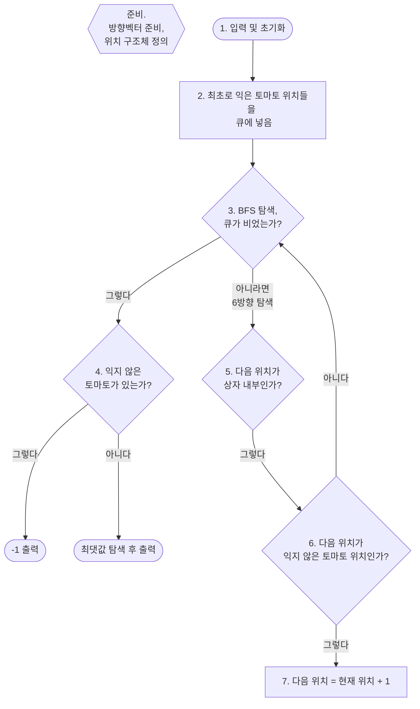

# [토마토 | 7569 | C++](http://boj.kr/7569)
BFS로 풀었다.

---
## 순서도


<br>

---

## 준비. 방향벡터 준비, 위치 구조체 정의
우선 6방향으로 이동하기 위한 방향벡터들,  
그리고 위치구조체 ```Coord```를 정해주었다.

```c++
int d[6][3] = {{0, 0, -1}, {0, 0, 1}, {0, -1, 0}, {0, 1, 0}, {1, 0, 0}, {-1, 0, 0}};

struct Coord {
	int y;
	int x;
	int z;
	
	Coord(int py, int px, int pz) {
		y = py;
		x = px;
		z = pz;
	}
};
```
<br>

## 1. 2. - 입력과 초기화
상자를 3차원 배열 ```Boxes```로 정의함에 따라  
입력과 동시에 최초 익은 토마토 위치들을 큐 ```Q```에 저장하였다.
```c++
int Boxes[102][102][102];
queue<Coord> Q;

void input()
{
	cin >> M >> N >> H;
	
	for(int h = 1; h <= H; ++h)
		for(int n = 1; n <= N; ++n)
			for(int m = 1; m <= M; ++m)
			{
				cin >> Boxes[n][m][h];
				
				if(Boxes[n][m][h] == 1)
					Q.push(Coord(n, m, h));
			}
}
```
<br>

## 3. BFS 탐색 - solution()
이제 ```Q```를 비워가며 너비우선 탐색을 한다.
```c++
int solution()
{
	while(!Q.empty())
	{
		// ...
	}
}
```
<br>

## 4. ```Q```가 다 비워졌다면 (탐색 종료)
이제 익지 않은 토마토를 찾는다.  
있다면 ```-1```을 출력하고,  
없다면 ```Boxes```에 저장된 값들을 탐색하여 그중 최댓값을 반환해서 종료한다.
```c++
int solution()
{
	while(!Q.empty())
	{
		// ...
	}

    if(getNotRipen())
		return -1;
	
	int result = 0;
	
    // 최댓값 찾기
	for(int h = 1; h <= H; ++h)
		for(int n = 1; n <= N; ++n)
			for(int m = 1; m <= M; ++m)
				if(Boxes[n][m][h] > result)
					result = max(Boxes[n][m][h], result);
	
	return result - 1; // 최초가 1로 시작했으므로
}
```
<br>

```Boxes```에는 각 위치까지 익는데 며칠이 걸렸는지가 저장되어 있다.  
(바로 다음 [5.](#5-q가-다-비워져있지-않다면) ~ [6.](#6-7---익지-않은-토마토-탐색)을 살펴보자)

<br>

## 5. ```Q```가 다 비워져있지 않다면
```Q```에는 최초로 익은 토마토 위치(```Coord```)들이 저장되어 있다.  
이제 **6 방향으로 너비우선 탐색을 하면서 익지 않은 토마토 위치들을 찾아나갈 것이다.**  

현재 위치 ```current```를 기준으로 6 방향을 ```for``` 문 탐색하여  
다음 위치 ```next```를 생성한다.
```c++
int solution()
{
	while(!Q.empty())
	{
		Coord current = Q.front(); Q.pop();
		
		for(int i = 0; i < 6; ++i)
		{
			Coord next = Coord(current.y + d[i][0], current.x + d[i][1], current.z + d[i][2]);
			
			// ...
		}
	}

    // ...
}
```
<br>

## 6., 7. - 익지 않은 토마토 탐색
다음 위치 ```next```가 상자 내부이고, 아직 익지 않은 위치라면  
현재 위치 ```current```에 저장된 값을 **익는데 걸린 날짜로 생각하여**  
```next```에는 ```current```보다 +1을 해서 저장해준다.
```c++
int solution()
{
	while(!Q.empty())
	{
		Coord current = Q.front(); Q.pop();
		
		for(int i = 0; i < 6; ++i)
		{
			Coord next = Coord(current.y + d[i][0], current.x + d[i][1], current.z + d[i][2]);
			
			if(isInternal(next))
			{
				if(Boxes[next.y][next.x][next.z] == 0)
				{
					Boxes[next.y][next.x][next.z] = Boxes[current.y][current.x][current.z] + 1;
					Q.push(next);
				}
			}
		}
	}

    // ...
}
```
<br>

---

## [전체 소스코드](http://boj.kr/95b97dc43b054b49874a19e4ea1b1faf)
```c++
#include <bits/stdc++.h>
using namespace std;

int d[6][3] = {{0, 0, -1}, {0, 0, 1}, {0, -1, 0}, {0, 1, 0}, {1, 0, 0}, {-1, 0, 0}};

struct Coord {
	int y;
	int x;
	int z;
	
	Coord(int py, int px, int pz) {
		y = py;
		x = px;
		z = pz;
	}
};

int M, N, H;
int Boxes[102][102][102];
queue<Coord> Q;

void input()
{
	cin >> M >> N >> H;
	
	for(int h = 1; h <= H; ++h)
		for(int n = 1; n <= N; ++n)
			for(int m = 1; m <= M; ++m)
			{
				cin >> Boxes[n][m][h];
				
				if(Boxes[n][m][h] == 1)
					Q.push(Coord(n, m, h));
			}
}

int getNotRipen()
{
	int notRipen = 0;
	
	for(int h = 1; h <= H; ++h)
		for(int n = 1; n <= N; ++n)
			for(int m = 1; m <= M; ++m)
				if(Boxes[n][m][h] == 0)
					notRipen++;
	
	return notRipen;
}

bool isInternal(Coord c)
{
	if(c.y >= 1 && c.y <= N && c.x >= 1 && c.x <= M && c.z >= 1 && c.z <= H)
		return true;
	
	return false;
}

int solution()
{
	while(!Q.empty())
	{
		Coord current = Q.front(); Q.pop();
		
		for(int i = 0; i < 6; ++i)
		{
			Coord next = Coord(current.y + d[i][0], current.x + d[i][1], current.z + d[i][2]);
			
			if(isInternal(next))
			{
				if(Boxes[next.y][next.x][next.z] == 0)
				{
					Boxes[next.y][next.x][next.z] = Boxes[current.y][current.x][current.z] + 1;
					Q.push(next);
				}
			}
		}
	}
	
	if(getNotRipen())
		return -1;
	
	int result = 0;
	
	for(int h = 1; h <= H; ++h)
		for(int n = 1; n <= N; ++n)
			for(int m = 1; m <= M; ++m)
				if(Boxes[n][m][h] > result)
					result = max(Boxes[n][m][h], result);
	
	return result - 1;
}

int main()
{
	ios_base::sync_with_stdio(0); cin.tie(0);
	
	input();
	cout << solution();
	
	return 0;
}
```